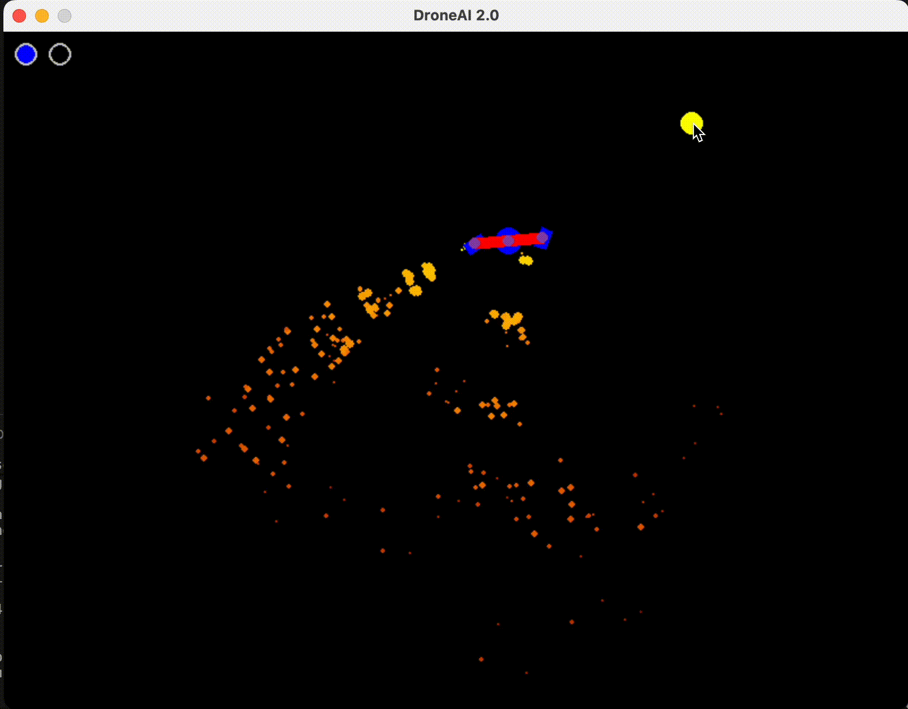

# DroneAI

DroneAI is an experiment in reinforcement learning, training an AI agent to pilot a 2D drone to reach moving targets in a simulated environment.

<p align="center">
  
</p>

## Quick Start

A pretrained model is included so you can see the drone fly immediately:

```bash
pip install -r requirements.txt
python3 Load.py
```

This loads the pretrained model from `Training/ModelEx.zip` and opens a pygame window where the drone chases your mouse cursor. Close the window to exit.

## Overview

A simulated 2D drone must learn to navigate to target locations using only its two propellers. The agent controls each propeller's **thrust power** (0–100%) and **tilt angle** (limited to ±60°, with a constrained turn rate), making flight a non-trivial control problem — the agent must learn to balance, steer, and stabilize entirely through trial and error.

## Observations

The agent receives the following information about its environment at each step:

| Observation | Description |
|---|---|
| Global Position | The drone's X and Y coordinates in the world |
| Velocity | The drone's current X and Y velocity |
| Rotation | The sine and cosine of the drone's current body angle |
| Angular Velocity | How fast the drone is rotating |
| Displacement to Target | The X and Y offset from the drone to the current target |

## Reward Structure

| Condition | Reward |
|---|---|
| Directly on target (within 10 px) | Large positive reward |
| Near target (within 20 px) | Medium positive reward |
| Alive and in bounds each step | Small positive reward |
| Tipping over (rotation exceeds ±60°) | Medium negative reward |

Targets relocate once the drone holds position on them long enough, with the required hold time decreasing as more targets are collected — pushing the agent to fly faster and more precisely over time.

## Model

DroneAI uses **Proximal Policy Optimization (PPO)** via [Stable Baselines3](https://stable-baselines3.readthedocs.io/). PPO is a policy gradient reinforcement learning algorithm that learns by collecting batches of experience, then optimizing a "clipped" objective to update the policy in a stable, sample-efficient way. The policy network is a simple multi-layer perceptron (`MlpPolicy`) that maps observations directly to continuous motor actions.

## Project Structure

| File | Description |
|---|---|
| `Game.py` | Environment and drone simulation logic (do not run directly) |
| `Train.py` | Trains a new model or continues training from an existing one |
| `Load.py` | Loads and runs a trained model for visualization |

## Usage

### Training a Model

Configure the following variables at the top of `Train.py`:

| Variable | Description |
|---|---|
| `LOAD` | Set to `True` to continue training from an existing model, `False` to train from scratch |
| `TIMESTEPS` | Number of training timesteps before the model is saved (default: 3,000,000) |
| `VISUALIZATION` | Set to `True` to render the simulation during training (not recommended — rendering significantly slows training) |
| `Model_Load_path` | Path to an existing model to load (used when `LOAD = True`) |
| `Model_path` | Path where the trained model will be saved |

```bash
python3 Train.py
```

### Running a Trained Model

Set the `Model_path` variable in `Load.py` to point to your saved model, then run:

```bash
python3 Load.py
```

## Installation

```bash
pip install -r requirements.txt
```

## Known Limitations

- **No air resistance** — the drone operates in a vacuum-like environment, so the agent does not learn to compensate for drag.
- **Simplified propulsion model** — real drones use fixed-axis rotors with variable RPM; here, propellers tilt freely, which is closer to a thrust-vectoring system than a traditional quadcopter.
